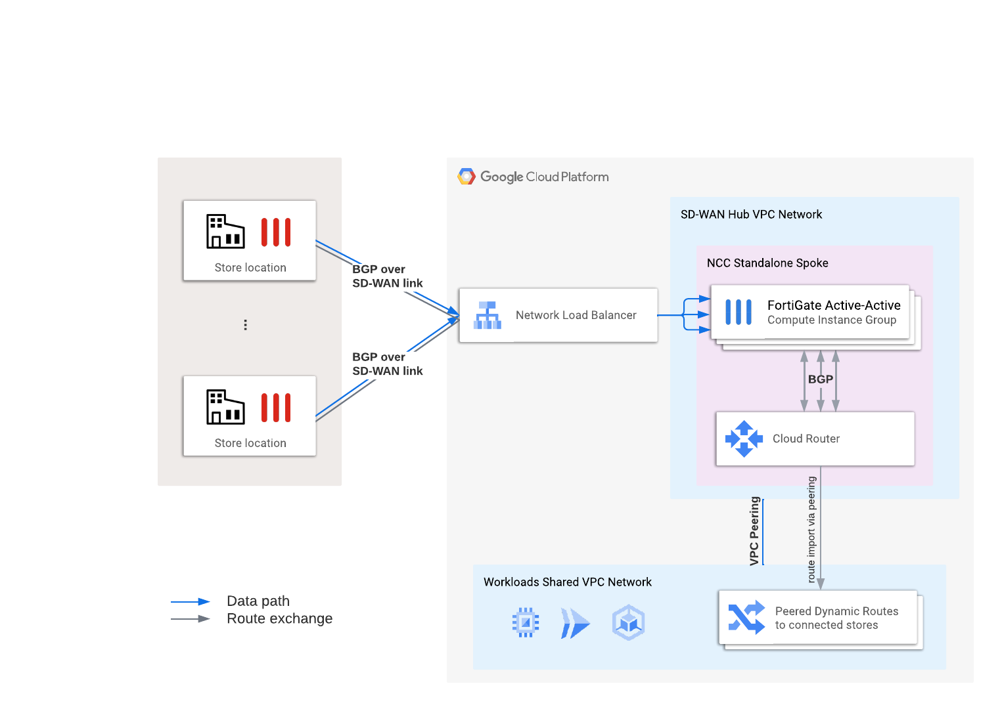

# FortiGate SD-WAN in NCC Spoke

This repo demonstrates how you can deploy an active-active array of FortiGate NVAs in Google Cloud to terminate multiple VPN tunnels from remote locations. This setup is useful for large amounts of on-prem locations where manual routing changes require too much work and a single FortiGate appliance might be not enough to handle the load. Routes are propagated automatically using BGP or OSPF from on-prem locations and advertised towards Google Cloud hub network, which in turn propagates them to all workload VPCs via VPC Peerings. CIDR ranges of the workload VPCs must be added to the advertised routes of the cloud router - this task is done automatically by terraform, it's enough to re-apply configuration after adding or removing new subnets (adding or removing new VPCs requires changing the variables). Mind that the FortiGates deployed by this template are stand-alone and you have to connect them to a FortiManager for synchronizing the configuration.

## How to deploy
1. Upload your FortiGate license files to make them available to terraform (by default as 1.lic, 2.lic and 3.lic)
1. Update the `terraform.tfvars` (or use another supported way to provide variables) and provide values for at least the following:
    - `project` - name of the project to deploy to
    - `fmg_ip` - IP address of FortiManager
    - `fmg_serial` - serial number of FortiManager
    - `wrkld_vpcs` - list of {name, project} pairs pointing to all your workload VPCs. If you use Shared VPCs, provide the name of the host project
1. Read through `variables.tf` to discover the remaining configuration options for this template. **Do not** change the default values in `variables.tf`, but rather override the defaults by adding your desired values to `terraform.tfvars` file.
1. When ready initialize the providers by running `terraform init`
1. Run `terraform plan -out tf.plan` to see what will be deployed and check for obvious errors
1. Run `terraform apply tf.plan` to deploy the solution

### Defaults
This template by default deploys `2` FortiGate `BYOL` appliances running `the newest 7.0` firmware in a `172.20.0.0/24` subnet in `europe-west3` region.

To run a different version or a different licensing mode you have to modify the `data.google_compute_image.fgt_image` in the template itself. The other options can be modified using variables.

## Cleanup
To remove all created resources simply run `terraform destroy`

## Note
This template uses terraform null resources as a workaround for missing capabilities of Google Cloud Terraform provider, which MIGHT cause dependency errors during deployment. Simply re-run `terraform apply`.

If you want to help in getting the provider updated fee free to vote for the issue [here](https://github.com/hashicorp/terraform-provider-google/issues/11206)

## Known issues
- Common errors during deployment due to peering operations competing for exclusive lock with each other and with other routing-related operations. Simply re-run `terraform apply` to finish deployment or use `-parallelism=1` option (will make your deployment run much slower).

## TODO:
- [x] multiple gates
- [x] connect to FMG (or use autoscaling?)
- [x] add ELB
- [x] add peering to pre-existing workload VPCs
- [ ] consider moving to single managed group instead of zonal UMIGs (BYOL licensing issues?)
- [ ] re-write as a day1 module for fgt ref architecture
